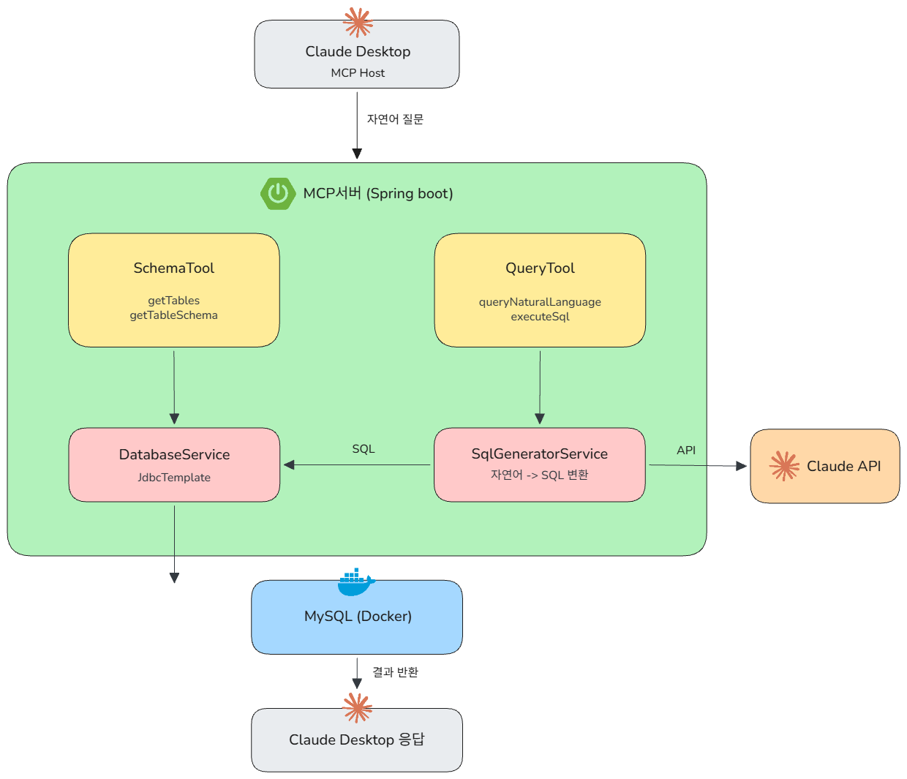

# DB MCP Server

자연어로 MySQL DB를 조회할 수 있는 MCP 서버입니다.<br/>
Spring Boot + Spring AI + Claude API를 활용하여 구현한 미니 프로젝트 입니다.
- 개발기간 : 2026.05.01 ~ 2026.06.18
- 프로젝트 블로그 [(바로가기)](https://jjuya.tistory.com/category/%ED%94%84%EB%A1%9C%EC%A0%9D%ED%8A%B8/Springboot-MCP-Server)


## 🛠️프로젝트 아키텍처

Claude Desktop(MCP Host)이 stdio 프로토콜로 Spring Boot MCP 서버와 통신하며, 자연어 질문을 수신한 서버는 JdbcTemplate으로 DB 스키마를 조회한 뒤 Anthropic Claude API에 프롬프트로 전달해 SQL을 생성하고, 생성된 쿼리를 MySQL에 실행한 결과를 MCP 응답으로 반환합니다.

## 🚀기술 스택
- Java 17
- Spring Boot
- Spring AI
- MySQL
- Docker


## ⚖️프로젝트 구조

```
src/main/java/com/example/mcp/
├── tool/
│   ├── QueryTool.java        # 자연어 → SQL 실행
│   └── SchemaTool.java       # 테이블 구조 조회
├── service/
│   ├── SqlGeneratorService.java  # Claude API 호출
│   └── DatabaseService.java      # MySQL 실행
└── McpApplication.java
```


## 💻동작 흐름

```
사용자 자연어 질문
        ↓
MCP 서버 (Spring Boot)
        ↓
1. DB 스키마 정보 읽기 (DatabaseService)
2. Claude API → SQL 자동 생성 (SqlGeneratorService)
3. MySQL 쿼리 실행 (DatabaseService)
        ↓
결과 반환
```


## 💻사용 예시

```
"users 테이블 구조 보여줘"
"4월에 주문한 목록 보여줘"
"가장 비싼 주문 3개 알려줘"
"이번달 총 매출 얼마야?"
"지난주 가입한 유저 몇 명이야?"
```


## 📌주의사항

- SELECT 쿼리만 허용 (데이터 변경 방지)
- API 키, DB 비밀번호는 환경변수로 관리
- `.gitignore`에 `.env` 추가 필수
